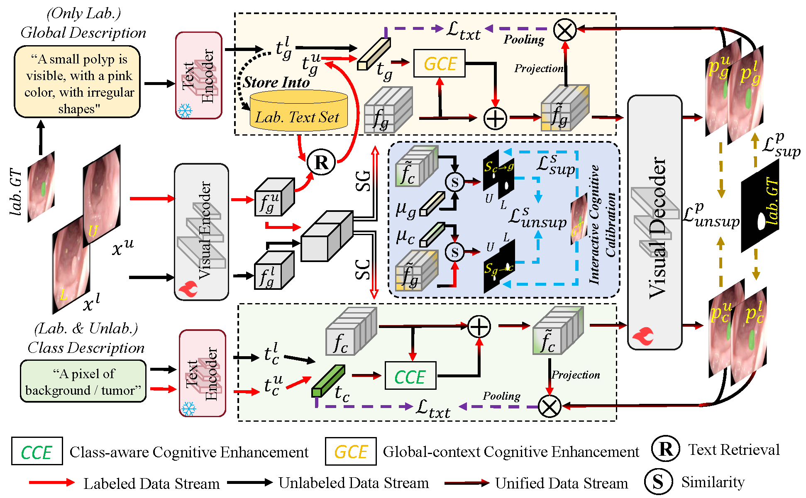

# DTSA: Dual Text-informed Semantic Alignment for Semi-supervised Medical Image Segmentation

This repository will host the implementation of the **DTSA** framework, a novel approach designed to enhance semi-supervised medical image segmentation through dual-textual guidance.

## 📌 Overview
Semi-supervised Medical Image Segmentation (SMIS) often faces challenges such as limited annotated data and model cognitive biases. **DTSA** addresses these issues by leveraging two complementary types of textual cues to improve the model's contextual understanding:

**Class-aware Cues**: Utilizes fixed templates (e.g., *"A pixel of [class]"*) to provide explicit category-specific attributes.

**Global-context Cues**: Incorporates instance-level descriptions (e.g., size, shape, and appearance) to capture comprehensive spatial features.

---

## 🏗️ Methodology

The DTSA framework integrates vision and language through three key components:

**Class-aware Cognitive Enhancement (CCE)**: Combines visual features with class-specific text cues to enhance feature representation.

**Global-context Cognitive Enhancement (GCE)**: Augments visual embeddings with global textual cues, using a retrieval-based approach for unlabeled samples.

**Interactive Cognitive Calibration (ICC)**: Facilitates mutual learning between the two types of text-enhanced features to mitigate cognitive biases.

---

## 📅 Project Status

The full source code, pre-trained models, and configuration files will be released upon the official acceptance of the paper. Stay tuned for updates!
